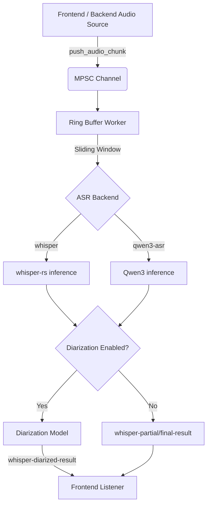

# tauri-plugin-whisper

Offline, real-time Speech-to-Text plugin for [Tauri v2](https://v2.tauri.app/) powered by [whisper.cpp](https://github.com/ggerganov/whisper.cpp) via [`whisper-rs`](https://docs.rs/whisper-rs).

**Features:**
- 🎙️ Real-time streaming transcription with sliding window inference
- 🤖 **New in Phase 2:** Multiple ASR backends including Whisper and Qwen3-ASR
- 🗣️ **New in Phase 2:** Speaker diarization support
- 🚀 Hardware acceleration: Metal (macOS), CUDA (Linux/Windows), CoreML (macOS)
- 📦 Built-in model downloader (HuggingFace, all model sizes)
- 🔒 Fully offline — no data leaves the device
- ⚡ Non-blocking audio pipeline via MPSC channels
- 🎯 **Accuracy Optimized:** Uses Beam Search decoding by default for Whisper.
- 🍏 **Apple Silicon Ready:** Built-in CoreML `ExecutionProvider` support for ONNX models (Diarization, VAD, Qwen3) to significantly reduce CPU usage.

## Architecture



## Installation

### Rust (Cargo.toml of your Tauri app)

```toml
[dependencies]
tauri-plugin-whisper = { path = "../tauri-plugin-whisper", features = ["full"] }
```

#### Feature Flags

Enable features specifically for your needs:

- `whisper`: (Default) Enables the standard Whisper ASR backend.
- `qwen3-asr`: Enables the new Qwen3-ASR backend.
- `diarization`: Enables speaker diarization support.
- `full`: Enables all core features (metal, qwen3-asr, diarization).
- `metal`: GPU acceleration on macOS (e.g. `cargo run --features "metal"`).
- `cuda`: GPU acceleration on Linux/Windows.
- `coreml`: Neural engine acceleration on macOS (for both Whisper and ONNX models).

### Register the Plugin (src-tauri/src/lib.rs)

```rust
pub fn run() {
    tauri::Builder::default()
        .plugin(tauri_plugin_whisper::init())
        .run(tauri::generate_context!())
        .expect("error while running tauri application");
}
```

### Capabilities (src-tauri/capabilities/default.json)

```json
{
  "identifier": "default",
  "description": "Default capabilities",
  "windows": ["main"],
  "permissions": [
    "core:default",
    "whisper:default"
  ]
}
```

## Usage

### TypeScript (Frontend)

```typescript
import {
  loadModel,
  startStream,
  pushAudioChunk,
  stopStream,
  downloadModel,
  downloadQwen3Model,
  downloadDiarizationModels,
  loadDiarizationModel,
  onPartialResult,
  onFinalResult,
  onDiarizedResult,
  onDownloadProgress,
} from 'tauri-plugin-whisper-api'; // or your mapped path

// 1. Download models
const unlistenProgress = await onDownloadProgress((p) => {
  console.log(`Download: ${p.percent.toFixed(1)}%`);
});

const modelPath = await downloadModel('base.en');
// Or use Qwen3: const modelPath = await downloadQwen3Model();

const diarizationModelDir = await downloadDiarizationModels();
unlistenProgress();

// 2. Load the main model
await loadModel(modelPath, true, 'whisper'); // set 'qwen3-asr' if using Qwen

// 3. Load diarization model (optional)
await loadDiarizationModel(diarizationModelDir, 8); // Max 8 speakers

// 4. Listen for transcription results
const unlistenPartial = await onPartialResult((r) => console.log(`[partial] ${r.text}`));
const unlistenFinal = await onFinalResult((r) => console.log(`[final]`, r.segments));
const unlistenDiarized = await onDiarizedResult((r) => {
  for (const seg of r.segments) {
    console.log(`[Speaker ${seg.speaker_id}] ${seg.text}`);
  }
});

// 5. Start streaming
await startStream({ language: 'en' });

// 6. Push audio chunks (from your audio capture pipeline)
const chunk = new Float32Array(3200); // 200ms at 16kHz
await pushAudioChunk(Array.from(chunk));

// 7. Stop when done
await stopStream();
unlistenPartial();
unlistenFinal();
unlistenDiarized();
```

## API Docs (New Commands)

### `load_model`
Loads the ASR model. Now accepts a `backend` string parameter (`"whisper"` or `"qwen3-asr"`).

### `download_qwen3_model`
Downloads the Qwen3-ASR model and returns the path.

### `download_diarization_models`
Downloads required models for speaker diarization and returns the base directory path.

### `load_diarization_model`
Loads the diarization models from the given directory and specifies a `maxSpeakers` count.

### `list_backends`
Returns a list of supported ASR backends compiled into the plugin.

## Events

| Event | Payload | When |
|-------|---------|------|
| `whisper-partial-result` | `PartialResultPayload` | Each new segment during inference |
| `whisper-final-result` | `FinalResultPayload` | After each inference pass completes (if diarization is off) |
| `whisper-diarized-result` | `DiarizedResultPayload` | After each inference pass (if diarization is on) |
| `whisper-download-progress` | `DownloadProgressPayload` | During model download |
| `whisper-stream-stopped` | `()` | When the worker thread has fully stopped |

## Models

| Model ID | Params | Disk | RAM | Recommended Use |
|----------|--------|------|-----|-----------------|
| `tiny` / `tiny.en` | 39M | 75 MB | ~390 MB | Testing, low-resource |
| `base` / `base.en` | 74M | 142 MB | ~500 MB | Quick transcription |
| `small` / `small.en` | 244M | 466 MB | ~1 GB | Good accuracy/speed balance |
| `medium` / `medium.en` | 769M | 1.5 GB | ~2.6 GB | High accuracy |
| `large-v3` | 1550M | 3.1 GB | ~4.7 GB | Best accuracy |
| `large-v3-turbo` | 809M | 1.6 GB | ~2.8 GB | Fast + accurate |

## License

MIT
